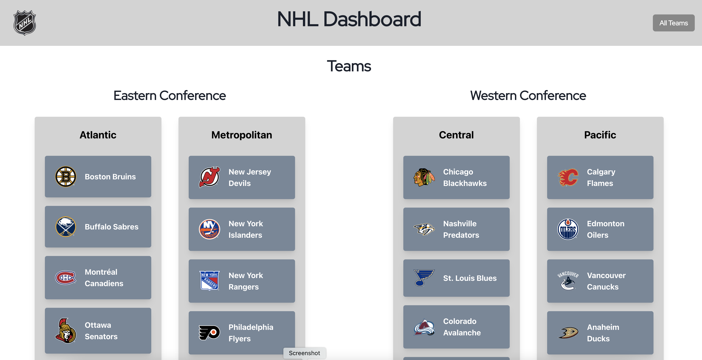
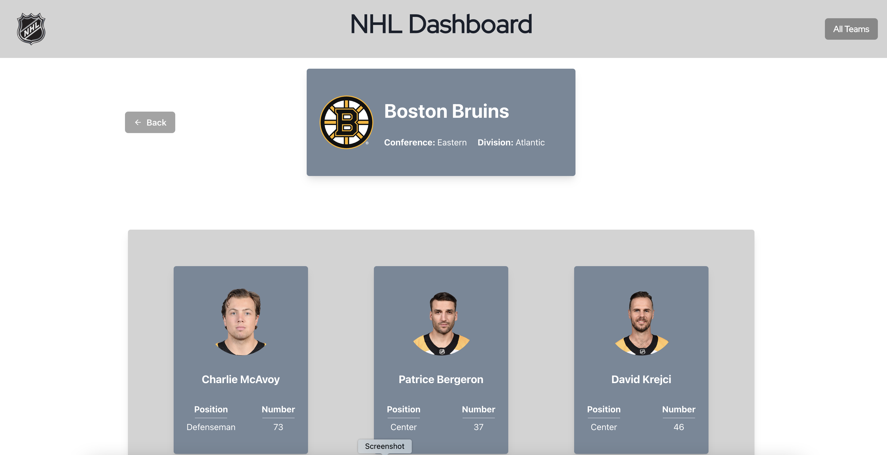

# NHL Dashboard

## Table of Contents

- [Installation](#installation)
- [Description](#description)
- [Technology Used](#technology-used)
- [Screenshots](#screenshots)
- [Links](#links)

## Installation

- In your terminal, navigate to the directory where you want to save the project and copy/paste the following:
  - `git clone git@github.com:tchestnut85/nhl-dashboard.git`
- Then, run the following commands:
  - `cd nhl-dashboard`
  - `npm install`
  - `npm run dev`
- In your browser, navigate to `http://localhost:3000/` to view to locally running app.

## Description

This is an NHL Team Profile dashboard which allows users to view all NHL teams, view a single team's details and roster, and also look at any current player's detailed profile.

This app was made using the React framework Next.js since it allows for easy client-side routing. ChakraUI was also used for making UI components and styling. Axios was used for fetching data from the NHL API. Redux is used for managing the client-side app state.

## Technology Used

## Screenshots

#### Home/All Teams Page:

#### Single Team Page with Current Roster:

#### Single Player Detail Page:

## Links

- **[GitHub Repo](https://github.com/tchestnut85/nhl-dashboard)**
- **[My Portfolio](https://tomchestnut.dev)**
- **[Connect with me on LinkedIn](https://www.linkedin.com/in/thomas-chestnut)**
